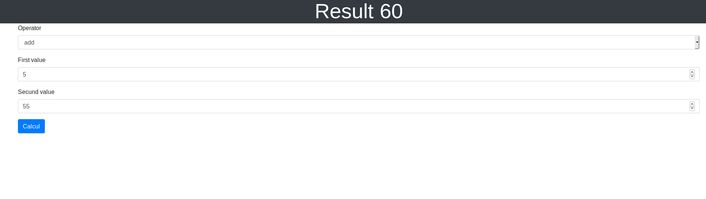

# Calculator

Calculator project use form, validation and solid principles.

## Stack
- php 7.4
- symfony 5
- docker
- mysql
- twig for front side

## Installation
This project require docker and docker-compose
In root of project (check you have permission)

```bash
git clone https://github.com/kevin-schmitt/calculator.git
cd calculator
docker-compose up -d
make install
```
[127.0.0.1:9011](http://127.0.0.1:9011)

## Test

```
make test
```

## Features

Just choice operation (add, mult, div, sub) and calc



## Technical description
File structure
```
    src/
        Controller
            CalculatorController # with POst method for calcul and receive total
        Calculator # logic code
            CalculatorHandler # entry for calcul with parameters from http request receive in controller
            CalculatorService # execute calcul with parameters
        Model
            CalculatorDTO # model for calculator app
    templates/
        Calculator/
            index.html.twig # form
    tests/
        Functional
            CalculatorTest
```

## Todo
- Add multiple operation (use session with last total calculated)
- refactor english name operation by symfony (add -> +, divide -> /)
- Use functional test with panther, currently need to resolve problem for run it inside of container
- Add unit tests
- Add log
- Add authentification
